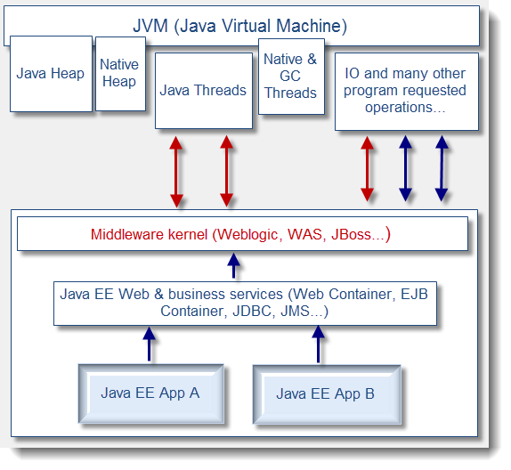
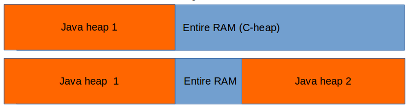
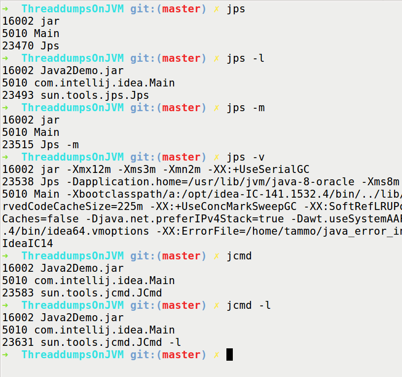
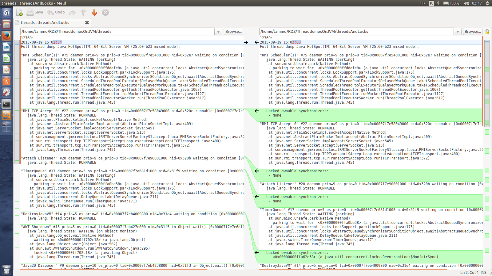

= Thread-dumps on JVM @ JDay Lviv
Tomasz Borek, @LAFK_pl, lafkblogs.wordpress.com
:toc:
:hardbreaks:
:icons: font

== Promise
How can you take a threaddump? 
Print threads? 
What is a safepoint and why you should care? 
Which tools can help and how? 
And when you have the threaddump... what's in there? 
We'll talk threads and locks. Dead and alive alike. 
We'll talk CLI and GUI (tools, of course). 
We'll talk about thread lifecycle. 
And naming. Oh, the naming! 
Example rich talk, though rather aimed at beginners. 

== JVM overview

From http://2.bp.blogspot.com/:

=== Threads

. instances of java.lang.Thread
. have associated native thread
. have names (or are named Thread#nextNumberInSequence)
. have local variables, accessible only to given thread

[IMPORTANT]
.Thread lifecycle
====
*Enum: `java.lang.Thread.State`:*

NEW:: Thread state for a thread which has not yet started.

RUNNABLE:: Thread state for a runnable thread.

BLOCKED:: Thread state for a thread blocked waiting for a monitor lock.

WAITING:: A thread in the waiting state is waiting for another thread to perform a particular action.

TIMED_WAITING:: A thread that is waiting for another thread to perform an action for up to a specified waiting time is in this state. 

TERMINATED:: A thread that has exited is in this state. 

`Thread.getState()` gives you that.
====
Native thread gets created in NEW and reclaimed upon thread termination.

CAUTION: _RUNNABLE_ means OK, right?

=== Thread limits?

Are there any?

What limits the threads?

Let's add more for just one JVM:

See `limit`, Bash built-in. In my case:
----
➜  ThreaddumpsOnJVM git:(master) ✗ limit
cputime         unlimited
filesize        unlimited
datasize        unlimited
stacksize       8MB
coredumpsize    0kB
memoryuse       unlimited
maxproc         63635
descriptors     1024
memorylocked    64kB
addressspace    unlimited
maxfilelocks    unlimited
sigpending      63635
msgqueue        819200
nice            0
rt_priority     0
rt_time         unlimited
----
Interesting limits are _stacksize_, _descriptors_ and _maxfilelocks_ when speaking about threads.

== How can you take a threaddump?

. `kill -3 JAVA_PID_HERE`

=== About kill command

kill:: send a signal to a process

 kill -9 111
 kill -s SIGKILL 111 
 kill -KILL 111

May be a shell built-in AND a command: `which kill`
Essentially a wrapper around _kill_ syscall.

. `kill -L` - no such option on my Ubuntu/Bash
.. `kill -l`
. `/bin/kill -L`
.. `/bin/kill -l` - same as built-in

[TIP]
.Further reading about `kill`
====
Excellent pieces of information, especially the first one:

. http://www.linux.org/threads/kill-signals-and-commands-revised.8096/
. http://tldp.org/LDP/Bash-Beginners-Guide/html/sect_12_01.html
====

=== About signals

`/bin/kill -L`

Default? *TERM*

`man --section 7 signals | grep SIGQUIT`
`man --section 7 signals | grep Core`

[CAUTION]
.Java and signals
==== 
`-Xrs`:: disables default signals for Java applications
====

=== PID of a Java process?
. ps aux | grep java
. pgrep java
. jps -l
jps::
Lists the instrumented Java Virtual Machines (JVMs) on the target
system. This command is experimental and unsupported.
. jcmd
jcmd::
sends diagnostic command requests to a running JVM.

image::javapid.gif[Image shows comparison of ways above]

[WARNING]
.`jps` output is empty?
====
. which user is running the Java process you are looking for?
. `ls -l /tmp/hsperfdata_YourUserHere/`
. check the `-Djava.io.tmpdir` flag or start JVM setting it to `=/someDir`.

More:
. http://stackoverflow.com/questions/3805376/jps-returns-no-output-even-when-java-processes-are-running
. https://devopsengineer.wordpress.com/2014/01/24/java-jps-cannot-see-running-java-processes/
====

== How can you take a threaddump?

. `kill -3 JAVA_PID`
. `jstack JAVA_PID`

jstack:: 
Prints Java thread stack traces for a Java process, core file,
or remote debug server. This command is experimental and unsupported.

TIP: Poor man's debugger? `jstack` in a loop... However, can pinpoint live-locks!

== How can you take a threaddump?

. `kill -3 JAVA_PID`
. `jstack JAVA_PID`
. `Ctrl`+`\`
. `jconsole`
. `jvisualvm`

[CAUTION]
.Dump location? 
====
. Your process' console
. Current directory
. JVM settings
.. different JVMs, different flags
. System settings?
.. `man core`
.. `cat /proc/sys/kernel/core_pattern`

http://stackoverflow.com/questions/2065912/core-dumped-but-core-file-is-not-in-current-directory
http://stackoverflow.com/questions/2062493/jvm-thread-dump-location

====

== Printing threads then?

`jcmd`

=== Going native...

`whichThreadIsIt.sh`

`ps -mo lwp,c -p 14222`

=== Safepoints

What is a safepoint and why you should care? 

=== Thread dump then

And when you have the threaddump... what's in there? 

. JVM and Java info
. Thread dump info
. Stack traces of threads
. Heap breakdown

=== Comparing printing threads
With `-l` we have also lock information, who holds what:

== Commands used during presentation
[listing]
----
jconsole
ctrl+break

kill -3 PID
kill -s 3 PID
kill -QUIT PID

type kill
man kill

man -k signal

man --section 7 signals | grep SIGQUIT
man --section 7 signals | grep Core

man core

vim /proc/sys/kernel/core_pattern

ps | grep java

pgrep java
pgrep -u root java
pgrep -u root,tammo java

jps -q

jps
jps -l
jps -m
jcmd
jps -v
jcmd -l

ls /tmp/hsperfdata_tammo/
while true; do; ls /tmp/hsperfdata_tammo/; done

jcmd -options
jcmd 12769 help
jcmd 12769 help Thread.print
jcmd 12769 Thread.print

jcmd 12769 Thread.print > threads
jcmd 12769 Thread.print -l > threadsAndLocks

jcmd 14222 Thread.print -l > threadsAndLocks

jstack 14222 > threaddump

man jcmd
man jinfo
man jstack
jvisualvm -J-Xverbose:gc

for i in $(seq 1 5); do; jstack 16002 > td$i; echo $i; sleep 5; done;

jconsole
jvisualvm
----

== Bibliography / Links 
Besides link already used and added earlier, few others caught my eye:

IMPORTANT: http://stackoverflow.com/a/14119817/999165[Peter Lawrey's one-liner for poor-man's profiler... in Java code itself!]

NOTE: http://www.javacodegeeks.com/2012/03/jvm-how-to-analyze-thread-dump.htmli[Pierre Hugues Charbonneau on Java Code Geeks presents thread dump analisys]

TIP: http://bugs.java.com/view_bug.do;jsessionid=fd2c497ca59504cd004165ec66fc?bug_id=6740344[Bug report turned doc enhancement request, on SIGHUP handling by JVM]

CAUTION: If you started process in the background and killed it's terminal, process might get killed. If it ain't, then 
http://stackoverflow.com/questions/593724/redirect-stderr-stdout-of-a-process-after-its-been-started-using-command-lin[to redirect it's output is no easy task]. Still, it's feasible. 
